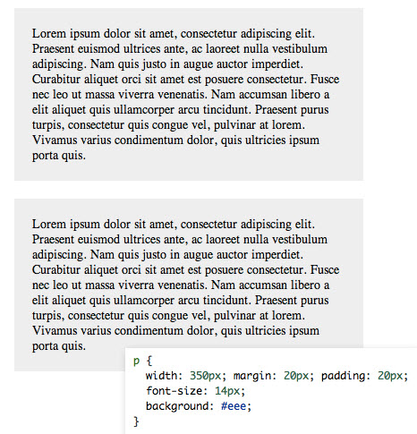
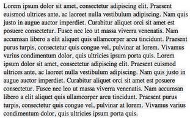

# The Display Property

Not all tags are created equal, and as a result not all tags are displayed the same way. Understanding how a tag will display by default allows you to better control page layout and predict how items will be displayed. Each HTML element is displayed as either `block` or `inline`.

## inline

`inline` items only take up as much space as needed. Consider the following HTML:

``` html
<span><a href="https://www.microsoft.com/">Microsoft</a> created <a href="https://code.visualstudio.com">Visual Studio Code</a>. Isn't that <strong>cool?!</strong></span>
```

This will display as:

[Microsoft](https://www.microsoft.com) created [Visual Studio Code](https://code.visualstudio.com). Isn't that **cool?!**

Some examples of inline elements are `<a>`, `<span>`, `<input>`, `<label>`, `<select>`, and `<textarea>`.

## block

`block` items take up the 100% of the width of the parent element. Even if the width of the element is less than the parent, the element will still take up 100% of the width of the parent. The most common side effect of this is the element will put a new line before and after the element.

Consider the following HTML:

``` html
<table>
  <tr>
    <th>Column</th>
  </tr>
  <tr>
    <td>
      <div>Hello</div>
      <div>World</div>
    </td>
  </tr>
</table>
```

This will generate:

| Column           |
| ---------------- |
| Hello<br />World |

Some examples of block elements include `<div>`, `<form>`, `<h1>`-`<h6>`, `<p>`, `<table>`, `<ul>`, `<ol>`, and `<li>`

## Interaction between inline and block elements

While it's valid to put inline elements inside block elements (an `a` works just fine in a `div`), block elements are **not** allowed inside inline elements, so you couldn't put a `div` inside an `a`.

## Controllilng the display

We can, however, change the default display style of HTML elements using CSS.

### Changing inline to block

`inline` is the default for `span` elements. As a result, this HTML...

``` html
<span>One</span>
<span>Two</span>
<span>Three</span>
```

... results in this output:

``` text
OneTwoThree
```

If we change our `span` to be `block`, we'll notice we get white space. This CSS...

``` css
span {
  display: block;
}
```

... renders this result on the same HTML

``` text
One
Two
Three
```

### Changing block to inline

On the reverse, suppose we have the following navigation menu:

``` html
<ul id="nav-menu">
  <li><a href="#">Home</a></li>
  <li><a href="#">Dashboard</a></li>
  <li><a href="#">About</a></li>
  <li><a href="#">Contact Us</a></li>
</ul>
```

The HTML would normally appear like this:

- _Home_
- _Dashboard_
- _About_
- _Contact Us_

Let's say we want to use a list, but create a horizontal menu on the top of our page. We could use the following CSS:

``` css
#nav-menu{
  list-style-type: none; /*This gets rid of the bullets.*/
}
#nav-menu li {
  display: inline;
}
```

Now we'd see:

_Home_ _Dashboard_ _About_ _Contact Us_

### Using inline-block

`inline-block` is a combination of `inline` and `block` as you might expect. Each element remains a `block`, but similar to `inline` only takes up the width necessary to display the information. This is probably best explained through the use of an example.

Let's start with the following HTML (which will use for all examples):

``` html
<p>Lorem ipsum dolor sit amet...</p>
<p>Lorem ipsum dolor sit amet...</p>
```

Let's set some colors just for display purposes.

``` css
p {
  padding: 20px;
  margin: 20px;
  width: 350px;
  font-size: 14px;
  background: #eee;
}
```

This will display two separate blocks because `p` is `block` by default.



If we change the display to `inline` we'll simply get two paragraphs running together, not really what we want.

``` css
p {
  padding: 20px;
  margin: 20px;
  width: 350px;
  font-size: 14px;
  background: #eee;
  display: inline;
}
```



Let's see if we can get them to display side-by-side. This is where `inline-block` comes into play. Each paragraph will remain as a `block`, so will display separately. However, any horizontal space left on the browser will be free to be used by other `inline-block` elements, thus behaving like `inline` as well.

``` css
p {
  padding: 20px;
  margin: 20px;
  width: 350px;
  font-size: 14px;
  background: #eee;
  display: inline-block;
}
```


Pretty cool, huh? What's happening here is that we're telling the browser to display the paragraphs inline, but allow them to retain their block-level characteristics. This means we can set a width and height manually and have the two elements remain distinct, but also have them appear next to each other in the document flow.

## What you learned

The display property is one of the most critical properties within CSS. You should remember that block elements take up the entire width of the screen, and inline elements are going to fill in the width of the screen with as many elements that will fit in the same screen width.

NEXT: [Box Model](./box_model.md)
